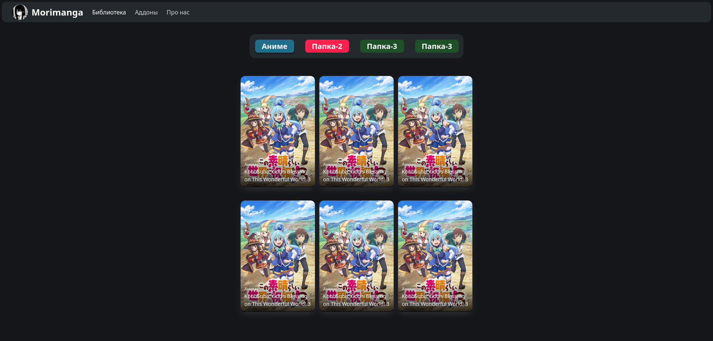
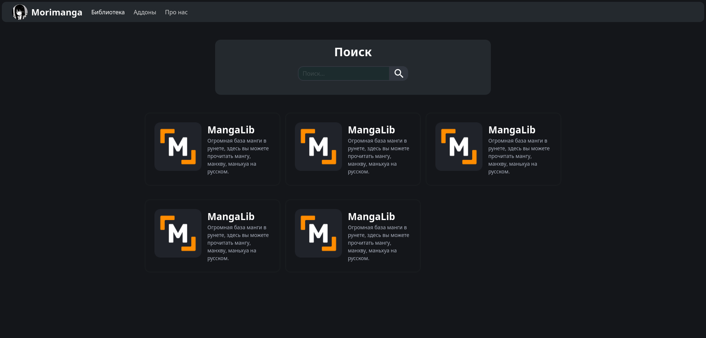
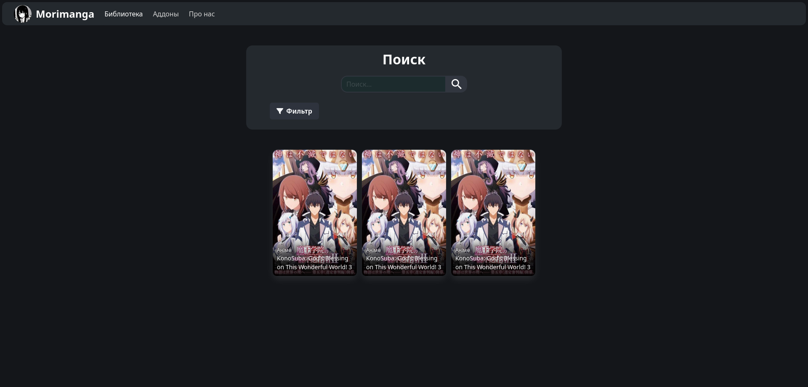

# Risu
### Фронтенд для Morimanga 
Написано на Svelte+SvelteKit и Bulma CSS

## Скрипты 
1. `npm run dev`: 
Запускает dev-версию с real-time изменениями на сайте.

2. `npm run build`: Делает статик-билд проекта.

3. `npm run electron-build`: Делает готовый билд Electron для платформ (.exe, .deb, etc.) (TODO)

## Скриншоты

## by Design
Написано marshallovski
